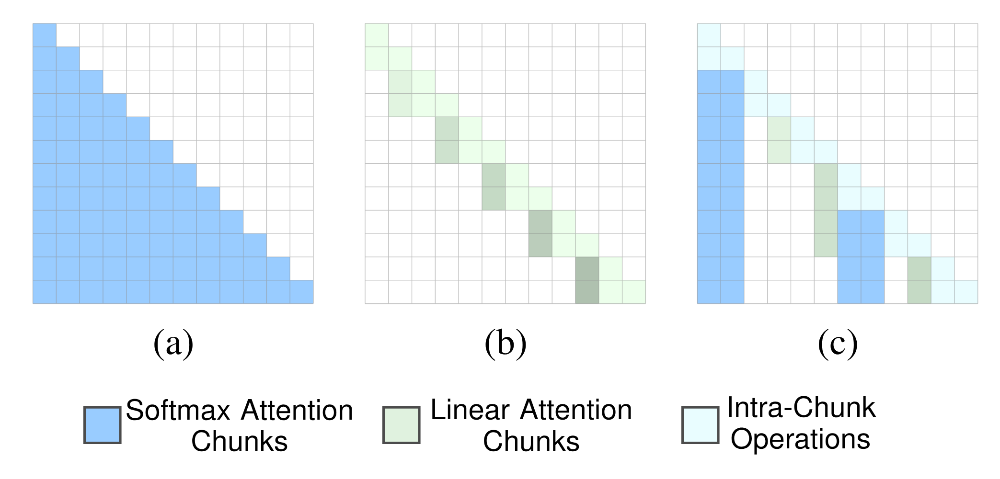

# Neural Attention Search Linear


This repository introduces a framework that searches for the optimal token-level hybrid attention models.
Currently, we allow searching for the optimal Gated DeltaNet-Softmax Transformer models.




The model first splits the input sequence into different chunks and selects the head-wise optimal operation types for each chunk based on the information contained in those chunks to search for both efficient and well performing architectures. 

usage: 
create a new conda environment with: 
```angular2html
conda create -n NAtSL python=3.11
conda activate NAtSL
pip install -e .
```
We use the [flame](https://github.com/fla-org/flame.git) package to train the model:
```
cd experiments
git clone https://github.com/fla-org/flame.git && cd flame
pip install -e flame/
cd ..
```

Then train the model:
```
cd experiments
sbatch slurm_train_model.sh
```

We could then evaluate the pre-trained model with `experiments/harness.py`

## Other model variations
Here, we also have several experimental implementations for other linear attention types:

* [GatedDeltaNet](src/nats/layers/natsl_attn_gdn.py)
* [Mamba2](src/nats/layers/natsl_attn_mamba2.py)


# The Paper
The detailed information can be found in our paper:

```
@inproceedings{deng-icml26a,
title={Neural Attention Search Linear: Towards Adaptive Token-Level Hybrid Attention Models},
author={Difan Deng and Andreas Bentzen Winje and Lukas Fehring and Marius Lindauer},
booktitle={Forty-third International Conference on Machine Learning},
year={2026},
url={https://arxiv.org/abs/2602.03681},
}
```
